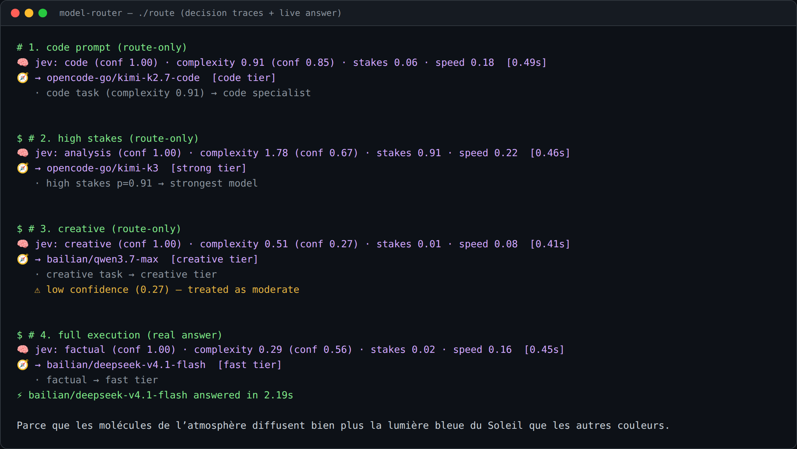
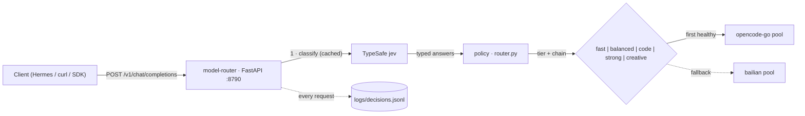
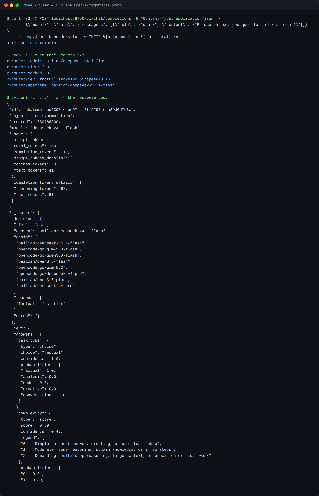
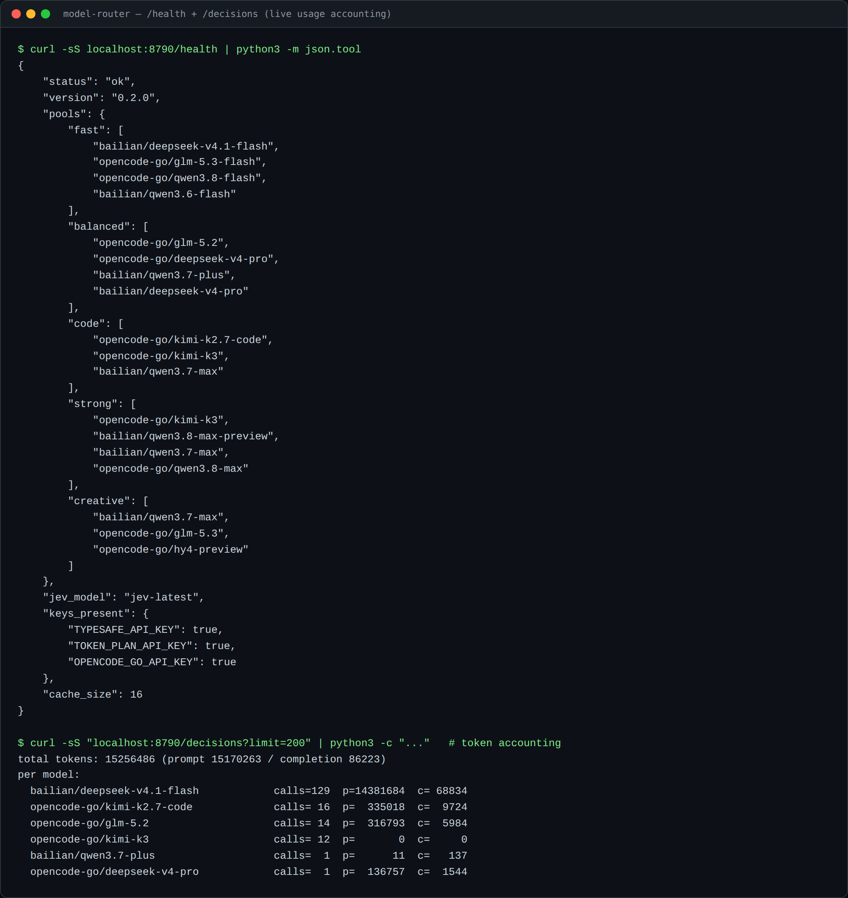

# model-router

**A semantically-routed LLM gateway.** Every incoming request is classified by
[TypeSafe](https://docs.typesafe.ai) **jev** (System One) — five task types,
complexity, stakes, speed-priority — then deterministic policy in Python picks
the best model from five live tier pools and proxies the request to it:
streaming, tools, and full conversation history passed through **verbatim**.

```
request ──► jev classify ──► policy (code) ──► tier chain ──► upstream model
            ~0.5 s (1st)     deterministic      first healthy    byte-for-byte relay
            cached (loop)                                         (SSE + tools)
```

Built as a real backend for agent workloads: drop-in OpenAI-compatible proxy,
usable from [Hermes](https://hermes-agent.nousresearch.com), any OpenAI client,
or curl. One small classifier call up front buys per-request model selection
across a pool of 15+ live models from two providers — with the routing trace
attached to every response.



## Highlights

- 🧠 **Typed classification, not prompt-and-parse** — jev returns a choice +
  confidence, a score, and two probabilities (nouls); ordinary code gates on
  them safely.
- 🧭 **Explicit policy** — thresholds and tier membership are plain constants
  in `router.py`, tunable and auditable. No hidden ML weights.
- 🔗 **Fallback chains** — each tier carries an ordered chain (own-tier first,
  balanced appended); dead upstreams are absorbed, max 4 hops, every hop
  recorded in the trace.
-  **Full passthrough** — the chosen model receives the request body
  untouched (message history, tools, `stream`, provider extras) and the
  response is relayed byte-for-byte. Works mid-agent-loop.
- ️ **Classification cache** — tool loops re-send the same conversation many
  times per turn; the decision is cached per `(system, user)` for 15 min, so a
  loop costs one jev call, not one per hop.
- 📊 **Observability built in** — `X-Router-*` response headers, an `x_router`
  trace in non-stream bodies, and one JSON line per request in
  `logs/decisions.jsonl` (tier, fallbacks, upstream model, raw jev scores,
  token usage).
- 🎚️ **Calibrated thresholds, not guesses** — `./calibrate` re-derives the
  gates from logged scores by quantile targeting (RouteLLM's method) and
  replays real decisions through the policy before you apply them.
- 🛡️ **Graceful degradation** — classifier down → deterministic balanced
  chain; no configuration makes the proxy hard-fail at routing time.
- ️ **Two interfaces** — OpenAI-compatible server + a CLI (`./route`) that
  prints the full decision trace.

## Architecture



## How it works — one request end to end

1. **Extract** — `_extract_messages` scans backwards for the *last user
   message* (so tool-loop turns whose last message is a `tool` result still
   classify on the original ask). System messages are concatenated and capped
   at 1,500 chars — Hermes system prompts run 20–40k chars; the routing signal
   lives in the user request.
2. **Cache** — key = `sha1(system + \0 + user)`. Hit (15-min TTL, 512 entries,
   LRU) → previous decision reused, `cached: true`.
3. **Classify** — one jev call asks four questions over the request state:

   | Question | Primitive | Runs over |
   |---|---|---|
   | `task_type` | choice | code / analysis / creative / factual / conversation |
   | `complexity` | score (0–2) | simple → demanding |
   | `high_stakes` | noul | would a wrong answer be costly? |
   | `speed_priority` | noul | fast-and-rough beats slow-and-precise? |

4. **Decide** — deterministic policy (see [Thresholds](#thresholds)):
   low task-confidence → safe `balanced`; high stakes → `strong`; speed and
   not-hard → `fast`; else by task type. The result is a tier, and the tier's
   chain (own tier + balanced appended, deduped) is the fallback order.
5. **Execute** — `_open_upstream` tries each route until one accepts
   (`chain[:4]`). Failures (non-200, network) are recorded and the next hop
   is tried.
6. **Relay** — streaming responses pass through as SSE byte-for-byte;
   non-stream responses are buffered, augmented with an `x_router` trace
   field, and returned with `X-Router-*` headers.
7. **Log** — every outcome (`done`, `stream_done`, `failed`,
   `classify_failed`, `stream_error`) appends one JSON line to
   `logs/decisions.jsonl`.



## Model pools

Five tiers, verified live (2026-09-18). First entry = primary; the rest are
same-tier fallbacks. Provider notes below.

| Tier | Primary | Chain |
|---|---|---|
| `fast` | `bailian/deepseek-v4.1-flash` | glm-5.3-flash → qwen3.8-flash → qwen3.6-flash → balanced chain |
| `balanced` | `opencode-go/glm-5.2` | deepseek-v4-pro → qwen3.7-plus → deepseek-v4-pro (bl) |
| `code` | `opencode-go/kimi-k2.7-code` | kimi-k3 → qwen3.7-max → balanced chain |
| `strong` | `opencode-go/kimi-k3` | qwen3.8-max-preview → qwen3.7-max → qwen3.8-max → balanced chain |
| `creative` | `bailian/qwen3.7-max` | glm-5.3 → hy4-preview → balanced chain |

- **opencode-go** (`opencode.ai/zen/go/v1`) requires a browser User-Agent and
  an `x-opencode-session` header — handled automatically.
- **bailian** = Aliyun Token Plan. The proxy uses the OpenAI-compatible
  sibling (`…/compatible-mode/v1/chat/completions`, Bearer auth, live-verified
  stream + tool calls); `router.py`'s single-shot CLI path uses the Anthropic
  Messages endpoint.

Deliberately excluded (failed probes — re-check before adding): grok-4.5/4.6
(not on plan), gpt-5.6-luna (500), deepseek-direct (no balance), kimi-coding
(quota), openai (billing), minimax-direct (plan limit).

## Thresholds

Policy constants at the top of the DECIDE section in `router.py`:

```python
CONF_GATE    = 0.40   # task_type confidence below this → safe balanced default
STAKES_GATE  = 0.65   # high_stakes noul at/above this → strong tier
SPEED_GATE   = 0.60   # speed_priority noul at/above this → fast tier
COMPLEX_HARD = 1.20   # complexity score (0–2) at/above this counts as hard
```

These are **conservative local defaults** — deliberately biased toward the
cheap tier, with the escalation path (stakes) kept for genuinely risky asks.
The industry practice, checked against the major routers in Sept 2026, is
unanimous on one point: *there is no universal value — every serious system
makes the threshold a tunable parameter and calibrates it on its own traffic.*

| System | Knob | Value / default | How it's set |
|---|---|---|---|
| RouteLLM (LMSYS) | strong-model threshold | router-specific (e.g. `0.11593` for MF @ 50% strong) | calibrate on your queries: `quantile(1 − target_strong_pct)` |
| vLLM semantic-router | confidence escalation | **0.72** normalized | per-route tuning; `cost_quality_tradeoff: 0.3` |
| vLLM semantic-router | embedding match | 0.72–0.75 | per rule |
| Aurelio semantic-router | route similarity | 0.5 default → **0.22–0.26** after `fit()` | fitted on labeled utterances |
| Azure AI Foundry router | quality band | Balanced **1–2%**, Cost **5–6%**, Quality = ignore cost | preset modes |
| NotDiamond | cost/quality blend | integer **0–10** (0 = quality-first, 10 = cheapest) | per-request or account |
| LiteLLM | retries / cooldown | 2 retries · 3 allowed fails · 5 s cooldown | env defaults |
| Hybrid LLM (ICLR'24) | routing threshold | grid search on ~500 samples, ≤ ~1% quality drop | calibration set |
| FrugalGPT | cascade score τ | learned per stage under a cost constraint | optimization |

What this implies for this router:

- **No number is "correct" in the abstract** — RouteLLM ships a *calibration
  command* instead of a magic constant; Aurelio's fitted thresholds moved a
  full 2× away from the hand default. Treat the constants above as a v0
  starting point, not truth.
- **Noul gates at 0.6–0.65 are the honest reading of "clearly yes"** — TypeSafe
  docs note a noul near 0.5 means *ambiguous*, not 50% intensity. `STAKES_GATE
  = 0.65` fires only when the stakes signal is unambiguous. If strong-tier
  spend matters less than missed escalations, 0.60 is defensible.
- **Confidence floors around 0.25–0.5 exist in the wild** — Aurelio's fitted
  values (~0.25) are more permissive than its 0.5 default; `CONF_GATE = 0.40`
  sits between the two camps.
- **The gate values are calibrated, not guessed.** Every decision now logs its
  raw jev scores, and `./calibrate` re-derives the gates from real traffic by
  quantile targeting (RouteLLM's recipe) instead of hand-picking numbers.
  See [Calibration](#calibration).

Validate any change against the routing battery — `./route --route-only` on a
set of representative prompts — before trusting it. Thresholds are policy,
not truth.

## Calibration

The gates above are conservative defaults; they were never tuned on data. The
calibration tool turns them into a **traffic-mix decision**:

```
threshold = quantile(1 − target)     # target = share of traffic allowed on the strong tier
```

Pick the share you are willing to pay for ("20% of requests may reach the
strong tier"), read the threshold off the observed score distribution, then
verify the effect by replaying real decisions through the actual policy.

1. Each decision logs a flat `scores` block — the raw jev values (see the log
   schema below).
2. `./calibrate` prints score percentiles, how much traffic each current gate
   admits, and the threshold that hits a target mix.
3. `--simulate NAME=VALUE` re-runs the *real* `decide()` on logged scores with
   candidate gates → resulting tier mix + how many decisions move.
4. `--write NAME=VALUE` edits `router.py` explicitly, then restart the unit.

```bash
./calibrate                              # summary + target table
./calibrate --target 0.2                 # 20% strong → threshold + realized %
./calibrate --simulate STAKES_GATE=0.55  # replay the policy in-sample
./calibrate --write STAKES_GATE=0.55     # apply (prints the diff) + restart
```

Real output on this host (small early sample — 13 unique decisions):

```
-- quantile targets (stakes → strong) --
  target   threshold   realized
     10%       0.830      15.4%
     20%       0.542      23.1%
     30%       0.206      30.8%
     40%       0.134      38.5%
```

Two guards keep the sample honest: cache hits (tool-loop hops replaying the
same conversation) are excluded by default, and identical score vectors are
deduplicated so a single prompt cannot dominate the distribution.
`--min-samples` (default 100) warns when the sample is too small to act on —
below that the thresholds are indicative only. Note that scores only exist
from the commit that introduced them onward, so the distribution grows with
real usage; `--days N` restricts to a recent window.

## vs. existing routers

The landscape was scanned in Sept 2026 — this router is a custom build with no
code derivation from any of these, but the comparison is fair to make:

| Tool | What it is | How it differs here |
|---|---|---|
| **LiteLLM router** | OSS gateway: OpenAI-compatible proxy, load balancing, fallbacks | Rule-based only — no per-request classifier. Here jev decides *which tier* semantically. |
| **RouteLLM** | Trained ML routers (BERT/MF/causal-LLM) between a strong and weak model | Requires preference-data training; 2 models only. Here: zero-shot judge, N tiers, no training. |
| **semantic-router (Aurelio)** | Embedding-similarity routing, no LLM call | Needs labeled route examples; binary match. Here: zero-shot typed judgments incl. stakes/speed. |
| **NotDiamond / OpenRouter Auto** | Hosted routing APIs | Closed, hosted, their pools. Here: your own pools, self-hosted, code and thresholds owned. |
| **vLLM semantic-router** | In-stack semantic routing for serving | Closest in spirit (confidence escalation, 0.72 gate); heavier to run, coupled to a serving stack. |

Honest positioning: the value here is the **assembly** — calibrated typed
classification + explicit policy + cross-provider fallback chains + full agent
passthrough — and the integration into a working agent stack. Not a new
routing algorithm.



## API surface

| Method | Path | Purpose |
|---|---|---|
| GET | `/health` | pool contents, key presence, cache size |
| GET | `/v1/models` | callable ids: `auto` + every pooled model |
| POST | `/v1/chat/completions` | the proxy. `model="auto"` → jev routing; `provider/model` or pooled bare name → forced; unknown bare name → 400 |
| POST | `/route` | decision trace only (no model call) |
| GET | `/decisions?limit=N` | recent log tail + token totals + per-model split |

Response extras: headers `X-Router-Model`, `X-Router-Tier`,
`X-Router-Cached`, `X-Router-Jev`, `X-Router-Upstream`; non-stream bodies carry
an `x_router` object with the full decision + jev answers.

## Decision log schema

One JSON object per line in `logs/decisions.jsonl` (schema is effectively the
database of this service):

```json
{"ts": 1789773569.67, "req_id": "8a17f86dfdff", "kind": "done",
 "chosen": "bailian/deepseek-v4.1-flash", "tier": "fast", "cached": false,
 "fallbacks": [], "upstream_model": "deepseek-v4.1-flash",
 "scores": {"task": "factual", "task_conf": 1.0, "complexity": 0.0,
            "complexity_conf": 0.9, "stakes": 0.02, "speed": 0.06},
 "reasons": ["factual → fast tier"],
 "usage": {"prompt_tokens": 40, "completion_tokens": 139, "total_tokens": 179},
 "elapsed_s": 2.57}
```

`scores` is the raw jev output for that decision — the input to `./calibrate`
(thresholds are re-derived from this column, never from guesses).

`kind` ∈ `done | stream_done | failed | classify_failed | buffer_error |
stream_error`. `fallbacks` lists every hop that failed before the chosen one
(empty = first model accepted). `usage` comes from the upstream response
(streamed: captured from the `include_usage` chunk).

## Usage

### As a Hermes provider

Registered in `~/.hermes/config.yaml` as a custom OpenAI-compatible provider
(`base_url: http://127.0.0.1:8790/v1`, default model `auto`). In chat:
`/model` → router → `auto`. Session-scoped by default; `--global` for
everywhere. `auto` = jev routing; any pooled model name = forced passthrough.

### CLI

```bash
./route "Refactor this function to be async: def fetch(url): ..."
./route --route-only "I need to decide whether to sign this contract"
./route --json "Write a haiku about Montreal"
./route --model bailian/qwen3.7-max "Summarize this"
echo "explain quicksort" | ./route
```

### Server

```bash
./serve.sh                       # uvicorn on 127.0.0.1:8790
systemctl --user enable --now model-router   # durable (unit installed)

curl localhost:8790/health
curl localhost:8790/v1/models
curl -X POST localhost:8790/route -d '{"prompt": "debug this stack trace"}'
curl -X POST localhost:8790/v1/chat/completions \
     -d '{"model": "auto", "messages": [{"role": "user", "content": "hi!"}]}'
curl "localhost:8790/decisions?limit=20"
```

## Project layout

```
model-router/
├── router.py                  # pipeline: classify → decide → execute → trace, pools, providers, CLI
├── server.py                  # FastAPI: proxy, route cache, SSE relay, decision log
├── calibrate.py               # threshold calibration (quantile targeting + policy replay)
├── route                      # CLI wrapper
├── calibrate                  # calibration wrapper
├── serve.sh                   # server launcher (127.0.0.1:8790)
├── requirements.txt           # httpx, fastapi, uvicorn
├── docs/screenshots/          # README evidence (real terminal captures)
└── logs/decisions.jsonl       # runtime log (git-ignored)
```

## Config / secrets

Keys are read at runtime from `~/.hermes/.env` (`TYPESAFE_API_KEY`,
`TOKEN_PLAN_API_KEY`, `OPENCODE_GO_API_KEY`) or the process environment —
never stored in this repo. The real environment wins when set. The server
binds `127.0.0.1` only.

## Engineering decisions

- **A judge call instead of embeddings.** Embedding routers need labeled
  route examples and only answer "which route is closest". One jev call
  (~0.5 s, cached per conversation) returns typed, calibrated judgments —
  including stakes and speed — that plain code can gate on.
- **Deterministic policy instead of letting the model choose the model.**
  The classifier answers questions; code owns the workflow. Thresholds are
  visible, testable (`--route-only`), and changeable without touching a model.
- **Tier chains, not single models.** Live probing found dead upstreams
  (402 balance, quota, plan limits) — chains absorb that reality. Cap of
  4 hops bounds worst-case cost per request.
- **Byte-for-byte relay.** Re-serializing an agent request risks dropping
  provider-specific fields (thinking tokens, tool extras). Pass the body
  through, relay the response through — the only modification is injecting
  `x_router` into non-stream bodies.
- **Two bailian endpoints on purpose.** The Anthropic Messages endpoint for
  direct single-shot calls; its OpenAI-compatible sibling for the proxy
  (verified: Bearer auth + SSE + tool calls + `stream_options`).
- **Cache keyed on (system, user), 15 min.** Derived from observed agent
  behavior: within one turn, tool loops re-send the same ask 5–10×; without
  the cache each hop would pay a jev call. The 1,500-char system cap keeps
  classification cost bounded.

## Roadmap

- ~~Log raw jev scores per decision → run RouteLLM-style quantile calibration
  on real traffic to re-derive the gates for a target tier mix.~~ **Done** —
  `calibrate.py` + `scores` in the decision log (see [Calibration](#calibration)).
- Per-request cost ceiling à la RouteLLM/bin-packing (budget parameter T).
- Outcome feedback loop (retry/edit detection) → adaptive gates.
- Prometheus metrics endpoint.

## License & privacy

Personal project, published for reference and demonstration. No license
granted for reuse yet — open an issue if you'd like one. Routing logs stay on
the host (`logs/`, git-ignored); no prompts are stored, only identifiers
(`req_id`), decisions and token counts.